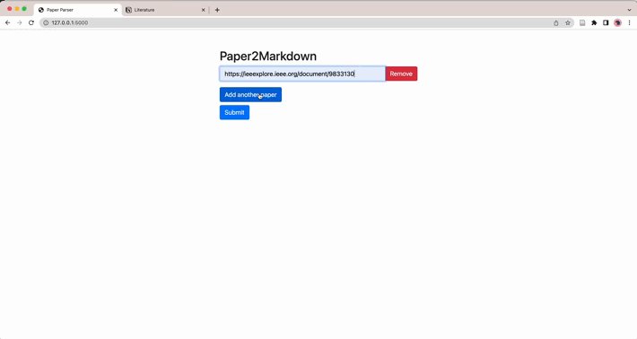

# Project Title: Paper2Markdown

## Introduction
Paper2Markdown is a Python-based tool designed to simplify the process of organizing academic papers. It allows you to fetch essential details about papers from different academic repositories like Arxiv, IEEE Xplore, and ACM, by simply entering the paper's URL. The tool retrieves the paper's title, authors, and PDF link and presents them in a convenient markdown format.

## Demo



Examples of paper's markfown format:

**LevelUp – Automatic Assessment of Block-Based Machine Learning Projects for AI Education** <em>Tejal Reddy, Randi Williams, Cynthia Breazeal</em> [[PDF]](https://ieeexplore.ieee.org/stamp/stamp.jsp?tp=&amp;arnumber=9833130)

**“What It Wants Me To Say”: Bridging the Abstraction Gap Between End-User Programmers and Code-Generating Large Language Models** <em>Michael Xieyang Liu, Advait Sarkar, Carina Negreanu, Benjamin Zorn, Jack Williams, Neil Toronto, Andrew D. Gordon</em> [[PDF]](https://dl.acm.org/doi/pdf/10.1145/3544548.3580817)


## Dependencies
The project has several dependencies that require installation:
- Python 3.6 or higher
- Beautiful Soup 4
- Requests
- Flask

## Installation

1. Make sure Python 3.6 or higher is installed on your system. If not, download and install it from [here](https://www.python.org/downloads/).

2. Clone this repository to your local machine. 
```bash
git clone https://github.com/username/paper2markdown.git
```
Note: Replace 'username' with your actual Github username.

3. Navigate to the project directory.
```bash
cd paper2markdown
```

4. Install the required Python dependencies.
Once you have installed the dependencies, you can run the Flask app:
```bash
python app.py
```
Then navigate to the provided URL in your web browser (for example, http://127.0.0.1:5000/ or another IP address that appears in the terminal). You will see a web interface where you can enter the URL of the paper you want to fetch details for.

## Contributing
Pull requests are welcome. For major changes, please open an issue first to discuss what you would like to change.

Please make sure to update tests as appropriate.

## References

The idea for this project was inspired by Mu Li's method of how to read and organize papers. You can check out his video [here](https://www.youtube.com/watch?v=q1G0xZCqYxY).


## License
MIT
